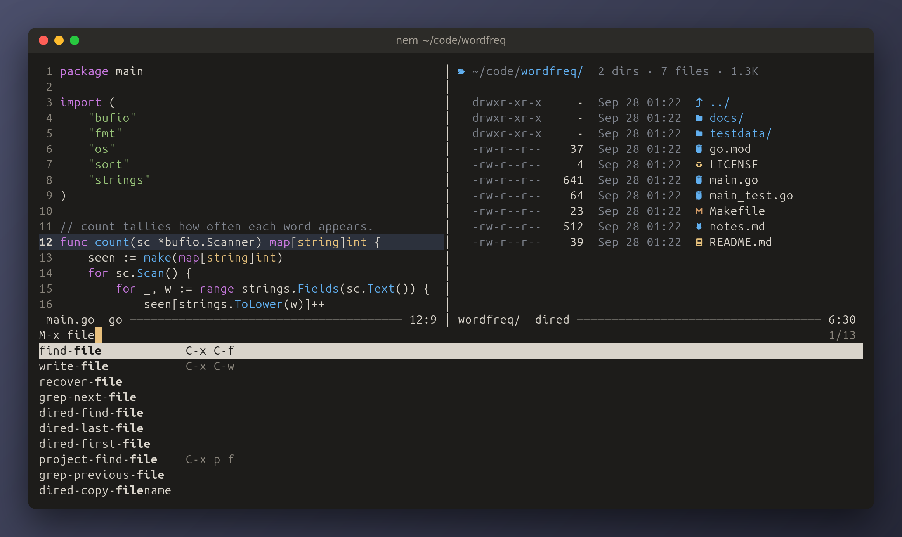
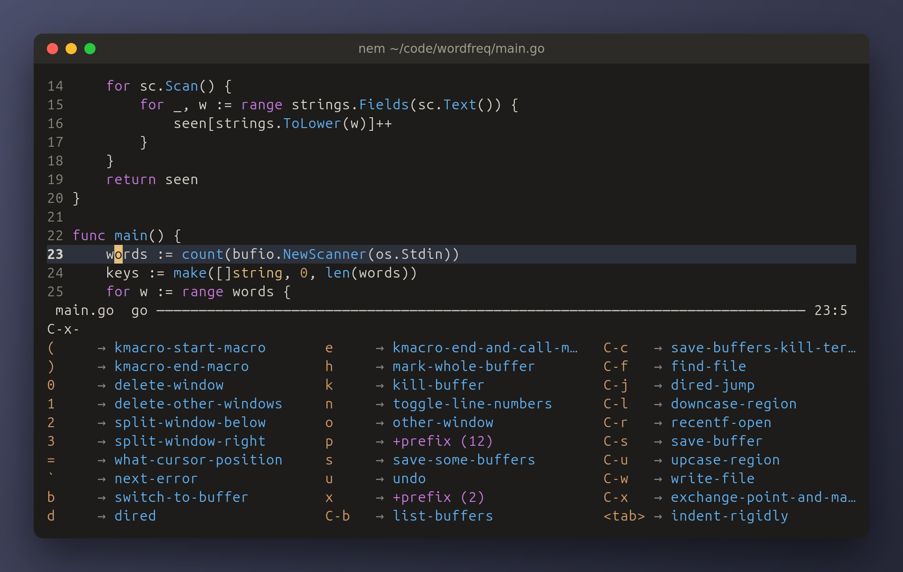
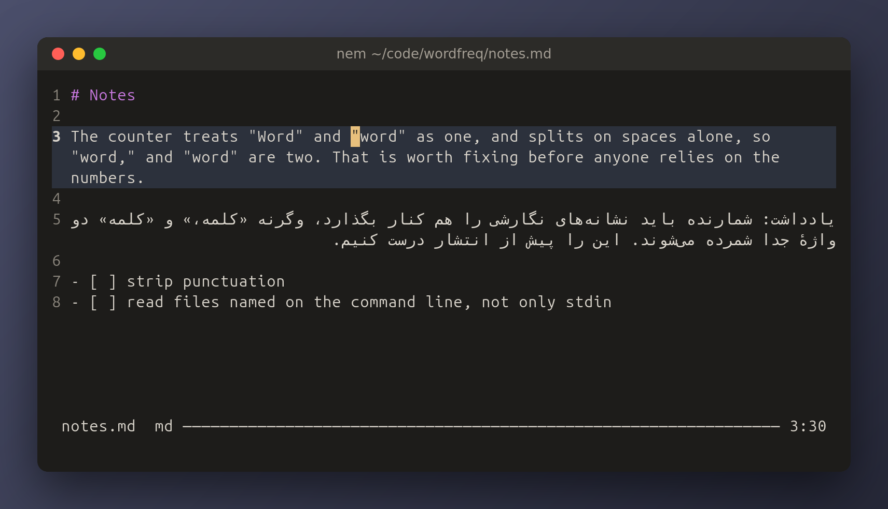

<div align="center">

# nem

**A terminal text editor with nano's simplicity and emacs's keys.**

[](https://github.com/Borderliner/nem/actions/workflows/ci.yml)
[](https://github.com/Borderliner/nem/releases/latest)
[](go.mod)
[](LICENSE)

[Install](#install) · [Quick start](#quick-start) · [Features](#features) · [Configuration](#configuration) · [Wiki](https://github.com/Borderliner/nem/wiki)



</div>

One window of text, a mode line and an echo line - nano's shape - driven by the
keys emacs taught your fingers: `C-f` moves forward, `C-k` kills a line,
`C-x C-s` saves, and the kill ring behaves the way you expect. It is one static
binary that starts at once, needs nothing installed beside it, and runs the same
on Linux, macOS and Windows.

- **Emacs's editing, without the weight** — the motion and editing set, the kill
  ring, incremental search, query-replace, keyboard macros, `M-x` with fuzzy
  completion, and a prefix key that shows what can follow it.
- **The tools a programmer reaches for** — ripgrep and fzf built in, dired,
  projects in the manner of projectile, `M-x compile` with every error a key
  away, search and replace across a project, shell commands and filters, imenu.
- **Right-to-left text done right** — Persian, Arabic and Hebrew laid out and
  joined, and key bindings that keep working whatever keyboard layout is on.
- **It does not lose your work** — saves that replace a file whole or not at
  all, autosaves, backups, and every unsaved buffer written away when the
  terminal closes or the connection drops.
- **Configured in Lua** — a small, sandboxed API for settings, key bindings,
  commands of your own and hooks; a broken config never takes the editor down.

## Install

**Download** a binary from the [latest release](https://github.com/Borderliner/nem/releases/latest):

| | amd64 | arm64 |
|---|---|---|
| Linux | `nem_…_linux_amd64.tar.gz` | `nem_…_linux_arm64.tar.gz` |
| macOS | `nem_…_darwin_amd64.tar.gz` | `nem_…_darwin_arm64.tar.gz` |
| Windows | `nem_…_windows_amd64.zip` | `nem_…_windows_arm64.zip` |

Every one is a single, fully static executable - no libc, no runtime, runs on
musl and Alpine too - so unpack it anywhere on your `PATH`. `checksums.txt`
carries each archive's SHA-256.

**With Go** 1.27 or later:

```sh
go install github.com/Borderliner/nem/cmd/nem@latest
```

<details>
<summary><b>From source</b></summary>

With [xmake](https://xmake.io):

```sh
git clone https://github.com/Borderliner/nem
cd nem && xmake
xmake run nem file.txt
```

```sh
xmake                                  # static, stripped build/<plat>/<arch>/release/nem
xmake f -m debug && xmake              # with symbols, for a debugger
xmake f --goos=windows --goarch=arm64 && xmake   # cross-compile
xmake install --user                   # into ~/.local/bin, no root needed
xmake install [-o DIR]                 # into DIR/bin, default /usr/local/bin
xmake test                             # gofmt, go vet, tests with the race detector
xmake bench -p ./editor -f Redraw      # benchmarks; xmake bench --help
```

Or with Go alone:

```sh
CGO_ENABLED=0 go build -trimpath -ldflags "-s -w" -o nem ./cmd/nem
```

`CGO_ENABLED=0` matters: Go turns cgo on by default when a C compiler is
present, and a dependency pulls in `os/user`, which then links libc. With it
off the binary is fully static, about 7 MB stripped, and every platform
cross-compiles from any other - which is how all six release builds come off
one machine.

</details>

## Quick start

```sh
nem notes.txt          # a file, new or not
nem .                  # a directory, listed in dired
nem                    # *scratch*
```

| Key | Does | Key | Does |
|---|---|---|---|
| `C-x C-f` | open a file | `C-s` `C-r` | search forward, back |
| `C-x C-s` | save | `M-%` | replace, asking at each match |
| `C-x C-c` | quit | `C-SPC` | set the mark, to select |
| `C-g` | cancel whatever is happening | `C-w` `M-w` `C-y` | cut, copy, paste |
| `C-/` `M-_` | undo, redo | `C-x b` | switch to another buffer |
| `M-x` | run any command by name | `C-x 2` `C-x 3` `C-x o` | split, and move between windows |
| `<f1> b` | list every key binding | `<f1> k` | say what a key does |

`C-x` means Control+x and `M-x` Meta+x - Alt+x, or Escape then x. Pause after a
prefix such as `C-x` and nem lists every key that can follow it:

<p align="center">

</p>

Every key is on the wiki's [Keybindings](https://github.com/Borderliner/nem/wiki/Keybindings) page.

## Features

### Editing

The emacs motion and editing set: `C-f` `C-b` `C-n` `C-p`, `M-f` `M-b`, `C-a`
`C-e`, `M-<` `M->`, `C-d`, `C-k`, `M-d`, `C-t`, `M-u` `M-l` `M-c`. Motion stops
at grapheme boundaries, so a decomposed `é` or a family emoji is one press, not
seven.

- **Mark and kill ring** — `C-SPC` sets the mark and the region is shown; `C-x h`
  selects everything. `C-w` kills, `M-w` copies, `C-y` yanks and `M-y` rotates
  through earlier kills. Consecutive kills gather into one, so `C-k C-k C-y`
  gives back what you took. Typing over a selection replaces it, in one undo.
- **Undo** — linear undo and redo, `C-/` and `M-_`; typing coalesces into one
  step, and a command or a Lua script's edits undo as one.
- **The rest of emacs's set** — `M-;` comments or uncomments in the file's own
  syntax, `M-/` completes a word from the text, `M-q` re-fills a paragraph (a
  comment block stays one), `M-{` `M-}` move by paragraph, `C-M-f` `C-M-b` `C-M-k`
  work on a balanced expression, `M-z` zaps to a character, `M-SPC` `M-\` `M-^`
  `M-m` deal with spaces and indentation, `M-=` counts words, `C-x =` describes
  the character at point.
- **Brackets and quotes pair themselves** — `(` gives `()` with point between,
  typing `)` steps over it, Backspace between them removes both, and over a
  selection `(` or `"` wraps it.
- **Lines** — `M-<up>` and `M-<down>` move the line, or every line of the
  region; `C-x C-u` `C-x C-l` change case; `M-x sort-lines`, `reverse-region`
  and `delete-trailing-whitespace` do what they say, each one undo.
- **Indentation** — `TAB` indents the way the file already does: the
  `.editorconfig` first, then the file's own lines, then the language's custom.
  With a region, `TAB` and `S-TAB` shift its lines a level either way and keep
  the region, and `C-x TAB` shifts by the prefix argument in columns.
- **Keyboard macros** — `F3` records, `F4` stops and plays; `C-u 3 F4` plays three
  times and `C-u 0 F4` until something fails, which is how a macro runs down a
  file. Searches and prompts in a macro replay exactly.
- **The prefix argument** — `C-u 4 C-f`, `M-4 C-f`, `C-u -` and the rest.

### Finding things

**ripgrep and fzf, built in** — nothing to install beside nem, and fast on
trees of hundreds of thousands of files.

| Key | Does |
|---|---|
| `M-s r` | search every file of the project as you type, with ripgrep's options: `-t go -w count`, `-i -g '!vendor/**' TODO`, `-F`, `-u` |
| `M-s f` | open any file under the project by a few letters of its path |
| `M-s l` | go to a line of the buffer by a few letters of it, the cursor following the list |

In `M-s r`, `RET` goes to the match highlighted and `M-RET` lists them all, as
`C-x p g` does - which takes ripgrep's options too. Every list under a prompt
reads fzf's syntax: words in any order, `'exact`, `^prefix`, `suffix$`, `!not`,
`a | b`. The [wiki](https://github.com/Borderliner/nem/wiki/Searching) has all
of it.

- **Incremental search** — `C-s` moves as you type, Backspace walks back, `C-g`
  returns to where you began, and past the last match it says so, then wraps.
  `C-r` goes the other way.
- **Replace** — `M-%` asks at each match, `y` `n` `!` `q`; `C-M-%` takes a regexp,
  with `\&` and `\1`…`\9` in the replacement. `M-x replace-string` and
  `replace-regexp` replace without asking.
- **Occur and imenu** — `M-s o` lists every line matching a regexp, each leading
  to its line; `M-g i` jumps to a function, type or heading by name, in Go,
  Python, JavaScript, TypeScript, Rust, C and C++, Java, Kotlin, Ruby, Lua,
  shell, Makefiles, Emacs Lisp and Markdown.
- **Completion** — `M-x`, `C-x C-f` and `C-x b` list their candidates under the
  prompt, as Vertico does, and narrow them fuzzily as you type: `fwc` finds
  `forward-char`, the matched letters picked out. `C-n` `C-p` step, `C-v` `M-v`
  page, `M-<` `M->` jump to either end, `RET` takes the highlighted one and
  `M-RET` exactly what you typed. `M-x` shows each command's keys beside it.
- **Memory** — `M-p` and `M-n` bring back what you typed at a prompt, this
  session or an earlier one; `C-x C-r` opens a recent file, and a file opens
  again where you left it. `C-u C-SPC` goes back to where the mark was.

### Files and directories

**Dired** — `C-x d` lists a directory, and `C-x C-j` the directory of the file you
are in, with point on the file. Directories come first, dotfiles wait for `.`, each name has
an icon for its kind, and one listing follows you around the tree.

| Key | Does |
|---|---|
| `RET` `M-<down>` · `^` `M-<up>` | open what is at point · go up a level |
| `M-p` `M-n` | back and forward through the directories listed, as a browser does |
| `m` `u` `t` `U` | mark · unmark · invert the marks · unmark all |
| `d` `x` · `D` | flag for deletion, then delete · delete at once |
| `R` `C` `+` | rename or move · copy · new directory |
| `(` `s` `g` `E` | hide the details · sort · re-read · open with the system's app |
| `C-x C-q` | edit the names as text, then `C-c C-c` renames the files to match |

Deleting asks for a `yes`, nothing is written over without asking, and a rename
takes any buffer visiting the file along with it. Editing the names is emacs's
wdired: `M-%` across every name, a keyboard macro numbering them, all the renames
done together or none.

- **Files that are not text** — a PDF, a picture, a song is not dumped into a
  buffer as noise: nem offers to open it with the system's app, or as text.
- **Files changed elsewhere** — a buffer without edits of its own follows its
  file after a `git checkout` or a formatter; one you have edited is never
  touched behind your back, and saving over a changed file asks first.
- **`.editorconfig`** — indentation, `trim_trailing_whitespace` and
  `insert_final_newline` are honoured, applied to the buffer so the screen shows
  what was written.

### Projects, compiling and the shell

A file's project is its repository, or the nearest directory holding a
`.projectile` file or a build file such as `go.mod`, and `C-x p` works on the
whole of it, as projectile does.

| Key | Does |
|---|---|
| `C-x p f` | find any file in the project by a few letters of its path |
| `C-x p p` | switch to another project, and find a file in it |
| `C-x p g` | search every file for a regexp, ripgrep's options and all, listing each matching line |
| `C-x p r` | query-replace across the project, file by file |
| `C-x p c` | compile the project, from its top |
| `C-x p t` | go from a file to its test and back |
| `C-x p b` `C-x p d` `C-x p S` `C-x p k` | its buffers · a directory · save its files · kill its buffers |

- **Compiling** — `M-x compile` runs a build, the tests or a linter and shows the
  output as it comes. It suggests the command the project's build files point
  to, then remembers yours. Every error, warning, traceback and failing test
  from gcc, clang, go, rust, tsc, javac, Python and JavaScript leads to its
  place, and `M-g n` `M-g p` step through them from anywhere.
- **Shell commands** — `M-!` runs one and shows what it prints, `C-u M-!` puts it
  at point, `M-|` feeds it the region, and `C-u M-|` replaces the region with
  the output, which makes anything a filter: `sort`, `jq .`, `column -t`. `M-&`
  runs one in the background.
- **The system clipboard** — `C-w` and `M-w` reach it over OSC 52, through SSH
  too, and `C-y` pastes what other programs copied. The terminal's own paste
  key inserts text verbatim, as one undo.

### Right to left, and any keyboard

<p align="center">

</p>

Persian, Arabic and Hebrew are shown in the order they are read, their letters
joined, by the Unicode bidirectional algorithm - most terminals do neither. In
prose a line takes its direction from its first letter; in code every line
stays left to right, with a Persian comment or string reading right to left
where it is. It looks the same in every terminal: one that would reorder the text
again, as GNOME Terminal and mintty do, is told not to, over ssh too. Only
Konsole, mlterm and macOS's Terminal, which cannot be told, are left to it.

Key bindings work whatever keyboard layout is on: with a Persian keyboard,
Control on the x key sends `C-ط`, and nem reads it as the `C-x` it sits on - for
Arabic, Hebrew, Russian, Ukrainian and Greek keyboards too. Typed on its own, a
letter is still the letter.

### Looks

- **Syntax colour** — over ninety languages built in, from Ada to Zig, and a
  palette for dark terminals and one for light. Each language is a short
  definition you can read and change, and adding one nem doesn't know is a file
  of its keywords and how it writes comments and strings: see
  [Languages](https://github.com/Borderliner/nem/wiki/Languages).
- **Your terminal's colours** — nem never paints a background, so it sits in
  whatever theme you already use.
- **Line numbers** — outside the text, so they can never be selected or copied,
  with a faint band under the line you are on. `C-x n` hides them.
- **Long lines** — cut off at the edge with a `$`, the view following the cursor
  sideways; or, with `line-wrap` on or `C-x x t`, folded into rows broken
  between words, `C-n` and `C-p` going a row at a time.
- **Icons** — beside names in dired and the file and buffer prompts, with a
  [Nerd Font](https://www.nerdfonts.com) or a terminal that ships its symbols.

### Your work is kept

- A save replaces the file whole or not at all: a full disk or a crash mid-save
  cannot leave it cut short.
- A backup of a file's previous contents on its first save, and an autosave
  after 30 seconds' pause or 300 keystrokes.
- Closing the terminal, a dropped SSH connection or a shutdown writes every
  unsaved buffer away before nem exits; opening the file again offers it back,
  and `M-x recover-file` restores it.
- A bug in nem is caught where it happens: the work is autosaved, a report is
  written, and the session carries on.

None of it is written beside your files. It all lives under
`~/.local/state/nem`, or `%LOCALAPPDATA%\nem` on Windows.

## Configuration

`~/.config/nem/init.lua` - `%AppData%\nem\init.lua` on Windows - is a real Lua
script:

```lua
nem.set("tab-width", 4)
nem.set("line-wrap", true)
nem.bind("<f5>", "save-buffer")

nem.command("strip-trailing-space", "Remove trailing whitespace everywhere.",
  function()
    for i = 1, nem.buf.line_count() do
      nem.buf.set_line(i, (nem.buf.get_line(i):gsub("%s+$", "")))
    end
  end)
nem.bind("C-c w", "strip-trailing-space")

nem.hook("before-save", function(buf)
  if buf.path:match("%.go$") then nem.run("strip-trailing-space") end
end)
```

A command you define is a command like any other: `M-x` finds it, a key runs it,
`<f1> k` describes it, and one `C-/` undoes it. Scripts get Lua's `string`,
`table` and `math` but not `io` or `os`, and a mistake in one is reported in the
echo area while nem carries on with its defaults.

Languages are configured beside `init.lua`, in `syntax/`, one small file each.
`M-x set-language` colours a buffer as any language, remembered for its file.
`M-x edit-language` opens the one on screen, a copy of nem's to change, or an
outline of a language nem doesn't know; saving it recolours every buffer:

```
language ada
files *.adb *.ads
ignore-case
comment --
string " doubled
keywords begin end if then else loop procedure function is return
declares function procedure function
```

## Documentation

The [wiki](https://github.com/Borderliner/nem/wiki) has the whole reference,
kept with the code and checked against it by the tests:

| Page | What it covers |
|---|---|
| [Configuration](https://github.com/Borderliner/nem/wiki/Configuration) | where `init.lua` lives, key notation, where nem keeps its state |
| [Settings](https://github.com/Borderliner/nem/wiki/Settings) | every option `nem.set` takes |
| [Lua API](https://github.com/Borderliner/nem/wiki/Lua-API) | `nem.set` `nem.bind` `nem.command` `nem.run` `nem.hook` `nem.buf` |
| [Keybindings](https://github.com/Borderliner/nem/wiki/Keybindings) | every key, globally, in each mode, in prompts |
| [Commands](https://github.com/Borderliner/nem/wiki/Commands) | every command, with its keys |
| [Searching](https://github.com/Borderliner/nem/wiki/Searching) | the built-in ripgrep and fzf, and the syntax lists narrow by |
| [Languages](https://github.com/Borderliner/nem/wiki/Languages) | the languages built in, and the format to add your own in |
| [Recipes](https://github.com/Borderliner/nem/wiki/Recipes) | configs to copy |

## Design

Layered so the hard parts are testable without a terminal:

| Package | Responsibility |
|---|---|
| `text` | Buffers, lines, the grapheme layout, edits, undo, saving |
| `keymap` | Key notation, the prefix tree, other keyboard layouts |
| `view` | Windows, the split tree, scrolling and wrapped rows |
| `command` | The commands, and the `Env` they act through |
| `ui` | Drawing with tcell: text, gutter, panels, right-to-left lines |
| `editor` | The event loop that wires it all together |
| `lua` | The config and scripting host |
| `dired` `project` `compile` `imenu` | Directory listings, projects, compiler output, definitions |
| `syntax` `highlight` `bidi` `fuzzy` | Language definitions, incremental colouring, bidirectional text, fuzzy ranking |
| `backup` `memory` `editorconfig` `sysopen` `icons` | Backups and autosaves, history, `.editorconfig`, the system's apps, file icons |

Two decisions shape the rest. **The minibuffer is a real buffer in a real
window**, as in emacs, so every editing key works inside a prompt with no code
of its own, and `M-x`, `C-s`, find-file and query-replace are all one mechanism.
And **commands never reach the screen** - they act through an interface, which
is why the command layer is tested headlessly: over 1,600 tests, run with the
race detector on Linux, macOS and Windows, beside a job that presses hundreds of
thousands of random keys looking for crashes, hangs and lost edits.

The design, with the decisions rejected and why, is in
[docs/design](docs/design/2026-09-18-nem-design.md).

## Not yet

Mouse support · an undo tree · multi-line search patterns · indentation that
knows a language's syntax (`TAB` follows the file's style, not its braces)

## Licence

MIT — see [LICENSE](LICENSE). Release binaries are statically linked, and so
carry the permissively licensed libraries listed in
[THIRD-PARTY.md](THIRD-PARTY.md). nem reads nano's syntax definitions from the
system when they are there but never distributes them; the rules it bundles are
its own.
